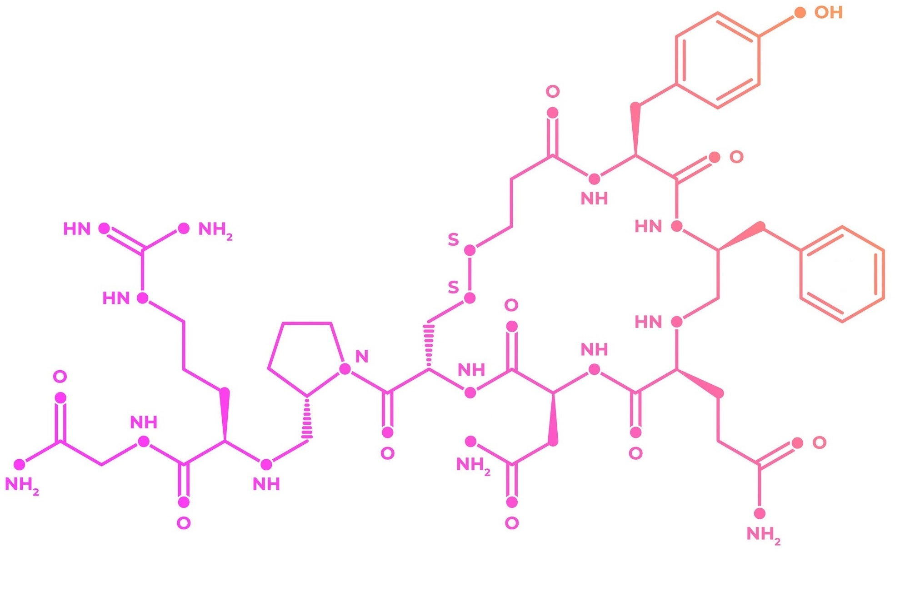

```{r setup, include=FALSE}
knitr::opts_chunk$set(echo = TRUE)
```


# Genes That Code Us
It is already known that our genes determine our looks such as height, eye or skin colour. In some sense, we can think about them like computer codes. We can programme a computer to do something and we will get the result. It can be something simple like printing out "Hello World!" or it can be something way more complex like writing an algorithm to figure out how a black hole should look like.
 
However, we are alive and far more complicated than our computers. Our phenotypes are part of us but they do not determine us completely. We are way more than that. We can feel love and joy. We question ourselves and the world. We seek for answers to understand things about us and others. This is the reason why we do science. It enables us to build and organise knowledge we have from thinking, questioning and testing those ideas.  

Psychologists study to understand human behaviour. Philosophers study fundamental questions about our existence and knowledge. Sociologists study social relationships that we built. However, they are not as sure in their studies as STEM field majors. It is more of a "general observation" than a scientific rule. 

At least that is how it was known until very recently geneticist started to check if our genes affect our behaviours. They combine the biological aspects of humans with psychological aspects, rely on statistics and draw the bigger picture. [This one particular study](https://www.ncbi.nlm.nih.gov/pmc/articles/PMC5441808/) I got my dataset is focusing on understanding the variation of hormone receptor genes and how it is associated with different behaviours of human society. 

From this dataset, I will mainly focus on the oxytocin receptor gene and how different alleles of the receptor gene affects our social life patterns in two levels. Empathy and sexual behaviour. Empathy allows us to connect emotionally with other people. It is a key factor to build constructive and understanding relationships. Sex persists as a dominant mechanism for producing offspring. Sexual behaviour ultimately dictates who gets to reproduce their genes into the next generation.


:::: {.columns style="display: flex;"}

::: {.column width="25%"}


:::

:::{.column width="75%"}

<span style="color: #002147;">**"Some people would claim that things like love, joy and beauty belong to a different category from science and can't be described in scientific terms, but I think they can now be explained by the theory of evolution." -Stephen Hawking**</span> 

:::

::::


```{r echo=FALSE, warning=FALSE, comment=NA, message=FALSE}
library(tidyverse)
library(readxl)
data <- read_excel("C:/Users/tanya/Downloads/pnas.1700712114.sd01 (1).xlsx")
```


# Data


:::: {.columns style="display: flex;"}

::: {.column width="50%"}

##### Data Collection

Healthy adults from the general population were recruited at the 2015 Edinburgh, Cheltenham and British science festivals, and at the University of Oxford Museum of Natural History. Individuals who used recreational drugs were excluded from taking part. 

The study was approved by the Combined University Research Ethics Committee (CUREC) of
the University of Oxford. All subjects signed informed consent forms when agreeing to take
part.

##### Genotyping

For genotyping, a single sample of saliva was taken from each participant using an OrageneDNA collection kit (collects 2mL of saliva for processing), which renders the samples acellular. The DNA was extracted using [Kleargene](https://www.biosearchtech.com/products/extraction-and-purification-reagents/dna-purification-kits/kleargene-silica#/.VtBw0RgzsQ2) technology and genotyped by [LGC](https://www.lgcgroup.com/) using [KASP](https://www.biosearchtech.com/products/pcr-kits-and-reagents/genotyping-assays/kasp-genotyping-chemistry#.VtBxdBgzsQ0) technology.


:::


:::{.column width="50%"}

``` {r echo=FALSE, message=FALSE}
options(knitr.kable.NA = '')
a <- data %>% select(age, EQ_mean, SOI_mean)
a <- na.omit(a)
colnames(a)[1] <- "Age"
b <- data.frame(as.factor(data$sex), as.factor(data$ethnicity), as.factor(data$rs4686302))
colnames(b) <- c("Sex", "Ethnicity", "rs4686302")
knitr::kable(summary(b))
```


``` {r echo=FALSE, message=FALSE}
options(knitr.kable.NA = '')
knitr::kable(summary(a))
```


:::

::::


# Oxytocin


:::: {.columns style="display: flex;"}

::: {.column width="50%"}

Oxytocin is a peptide hormone and neuropeptide. It is normally produced in the hypothalamus and released by the posterior pituitary. It plays a role in social bonding, sexual reproduction, childbirth, and the period after childbirth$^{[1]}$.

Oxytocin is derived by enzymatic cleavage from the peptide precursor encoded by the human OXT gene. OXTR is the receptor that oxytocin binds to. The [rs4686302](https://selfdecode.com/snp/rs4686302/) is a single nucleotide polymorphisms of OXTR. 

Single nucleotide polymorphisms(SNPs), are the most common type of genetic variation among people. Each SNP represents a difference in a single DNA building block, called a nucleotide.

:::


:::{.column width="50%"}





:::

::::


:::: {.columns style="display: flex;"}

::: {.column width="50%"}


```{r echo=FALSE, warning=FALSE, tidy=TRUE}

ggplot(data, aes(x=rs4686302, color=sex)) + geom_bar(fill="white") + ggtitle("Gene Alleles by Sex in Population")

```

:::

:::{.column width="50%"}

There are three alleles for rs4686302 gene: 
 
+ CC: Two cytosine 
+ TT: Two thymine
+ CT: Cytosine and thymine 

There were many studies involving alleles of rs4686302 SNPs of OXTR and how these alleles affect social behaviour of humans. One study found that for males, CC is the most empathetic, especially with emotional empathy and CT the least empathetic allele$^{[2]}$.

We can see from the plot that CC allele is the most common between men and women in our dataset population. 


:::

::::


# Empathy Quotient

Empathy is a combination of the ability to feel an appropriate emotion in response to another's emotion and the ability to understand the others' emotion. 


Empathy quotient (EQ) is a psychological self-report measure of empathy developed at the University of Cambridge. It is based on a definition of empathy that includes cognition and affect.


EQ was developed in response to what the authors considered to be a lack of questionnaires which measure empathy exclusively: other measures such as the questionnaire measure of emotional empathy and the empathy scale have multiple factors which are uncorrelated with empathy, often associated with social skills or the ability to be emotionally aroused in general$^{[3]}$. 


Higher scores of mean indicates higher empathy and lower scores of mean indicates lower empathy. 


## EQ Difference Regarding Sex

Does EQ differ regarding sex? In order to check the question, we have to set an alternative hypothesis and test it statistically. 


+ Null hypothesis: EQ does not differ by sex in the population.
+ Alternative hypothesis: EQ differs by sex in the population.


In order to test this hypothesis, we will have a threshold of 0.05 (95% confidence interval). In statistical testing, t-test for two samples will be used (mean equality of normal distribution for two numerical variables). 


:::: {.columns style="display: flex;"}

::: {.column width="50%"}

```{r echo=TRUE, warning=FALSE, tidy=TRUE, comment=NA}
t.test(EQ_mean~sex, data=data)
```

:::

:::{.column width="50%"}

```{r echo=FALSE, warning=FALSE, tidy=TRUE}
ggplot(data, aes(x=EQ_mean, color=sex)) +
  geom_histogram(fill="white", alpha=0.5, position="identity", bins = 20) + ggtitle("EQ by Sex")
```

:::

::::


P-value is equal to 2.2e-16 which means it is $2.2\times10^{-16}$. P-value is smaller than confidence interval therefore we reject the null hypothesis. 

This means EQ mean differs in the population between women and men. Women tend to score higher in EQ mean. This indicates that women tend to be more empathetic than men. In avarage, women have the ability to understand the others' emotions better than men.


# Sociosexual Orientation Inventory


Sociosexual orientation is the individual difference in the willingness to engage in sexual activity outside of a committed relationship. 


Sociosexual orientation inventory (SOI-R) is designed to measure sociosexuality. Lower scores indicate that those individuals are less willing to engage in casual sex and they rather seek long term relationship with commitment and emotional closeness. On the other hand, higher scores mean that individuals are more willing to have casual sex and more comfortable engaging in sex without love, commitment or closeness.$^{[4]}$


Individuals who have higher SOI scores tend to score higher also on openness to experience,$^{[5]}$ and be more extraverted,$^{[6]}$ less agreeable$^{[6]}$, lower on honesty-humility$^{[7]}$, more erotophilic$^{[8]}$, more impulsive$^{[9]}$, more likely to take risks$^{[9]}$, more likely to have an avoidant attachment style$^{[10]}$, less likely to have a secure attachment style$^{[11]}$, and score higher on the Dark Triad traits (i.e. narcissism, Machiavellianism, psychopathy)$^{[12]}$. 


## SOI Difference Regarding Sex


+ Null hypothesis: SOI does not differ by sex in the population.
+ Alternative hypothesis: SOI differs by sex in the population.


In order to test this hypothesis, we will have a threshold of 0.05 (95% confidence interval). In statistical testing, t-test for two samples will be used (mean equality of normal distribution for two numerical variables).


:::: {.columns style="display: flex;"}

::: {.column width="50%"}


```{r echo=TRUE, warning=FALSE, tidy=TRUE, comment= NA}
t.test(SOI_mean~sex, data=data)
```


:::

:::{.column width="50%"}


```{r echo=FALSE, warning=FALSE, tidy=TRUE}

ggplot(data, aes(x=SOI_mean, color=sex)) +
  geom_histogram(fill="white", alpha=0.5, position="identity", bins = 20) + ggtitle("SOI by Sex")

```

:::

::::


P-value is equal to 8.569e-16 which means it is $8.569\times10^{-16}$. P-value is smaller than confidence interval therefore we reject the null hypothesis. 

This means that SOI scores differ regarding sex and men tend to have higher SOI scores in the population. It also indicates that on average, men tend to be more open for casual sex, more extraverted, more open for experience than women. It also means men tend to be less agreeable and more likely to take risks than women. 


# Correlations


##### *SOI mean ~ EQ mean by Sex*

When EQ mean is mapped by SOI mean, the data is very diverse and hard to understand. We can group it by sex in order to improve the graph. 
The graphs support the results of statistical tests. 

+ Women score high in EQ mean and low on SOI mean. 
+ Men score low in EQ mean and high on SOI mean. 


:::: {.columns style="display: flex;"}

::: {.column width="50%"}


```{r echo=FALSE, warning=FALSE, comment=NA, tidy=TRUE, message=FALSE}

ggplot(data, aes(x=SOI_mean, y=EQ_mean, color=sex)) +
  geom_point(size=2) + ggtitle("Scatterplot EQ mean~SOI mean")

```


:::

:::{.column width="50%"}


```{r echo=FALSE, warning=FALSE, comment=NA, tidy=TRUE, message=FALSE}

ggplot(data, aes(x=SOI_mean, y=EQ_mean, color=sex, shape=sex)) +
  geom_point() + 
  stat_ellipse() + ggtitle("Scatterplot EQ mean~SOI mean Grouped by Sex")

```


:::

::::


##### *EQ mean by rs4686302 SNPs*


+ We can see that women score higher than men in EQ mean for all three alleles. 
+ Women who have TT allele score the highest in EQ mean in average. 

:::: {.columns style="display: flex;"}

::: {.column width="50%"}


```{r echo=FALSE, warning=FALSE, comment=NA, tidy=TRUE, message=FALSE}

ggplot(data, aes(x=rs4686302, y=EQ_mean, colour=sex)) + 
  geom_boxplot() + ggtitle("EQ mean by rs4686302 SNPs")

```


:::

:::{.column width="50%"}


```{r echo=FALSE, warning=FALSE, comment=NA, tidy=TRUE, message=FALSE}

ggplot(data, aes(x=rs4686302, y=EQ_mean, colour=sex)) + 
  geom_point()+
  geom_smooth(method=lm, formula= y~x, se=FALSE) + ggtitle("EQ mean by rs4686302 SNPs")

```

:::

::::


##### *SOI mean by rs4686302 SNPs*


+ Men score higher than women in SOI mean in all three alleles. 
+ Men who have a TT allele, score the highest between other men in SOI mean. 
+ Women who have TT allele, score the least in SOI between other women.


:::: {.columns style="display: flex;"}

::: {.column width="50%"}


```{r echo=FALSE, warning=FALSE, comment=NA, tidy=TRUE, message=FALSE}

ggplot(data, aes(x=rs4686302, y=SOI_mean, colour=sex)) + 
  geom_boxplot() + ggtitle("SOI mean by rs4686302 SNPs")

```

:::

:::{.column width="50%"}


```{r echo=FALSE, warning=FALSE, comment=NA, tidy=TRUE, message=FALSE}

ggplot(data, aes(x=rs4686302, y=SOI_mean, colour=sex)) + 
  geom_point()+
  geom_smooth(method=lm, formula= y~x, se=FALSE) + ggtitle("SOI mean by rs4686302 SNPs")

```


:::

::::


# Conclusion


We have used a relatively small sample-sized dataset and simple statistical tools. Although we can say, there is a relationship between genetics and behaviour traits. People who share similar genetic features are more likely to share behaviour characteristics too.

Genetics is a new section of biology and has a lot to offer. It helps to understand where did we come from and who are we.

Technological improvements in genetic sampling will allow us to discover deeper with time with relying on data science.

As Newton stated, we can stand on the shoulders of giants and take the knowledge further that one day we might be even able to understand and describe love, joy and beauty in scientific terms. 


# References


:::: {.columns style="display: flex;"}

::: {.column width="50%"}


1. [@1]

2. [@2]

3. [@3]

4. [@4]

5. [@5]

6. [@6]

:::

:::{.column width="50%"}


7. [@7]

8. [@8]

9. [@9]

10. [@10]

11. [@11]

12. [@12]


:::

::::


